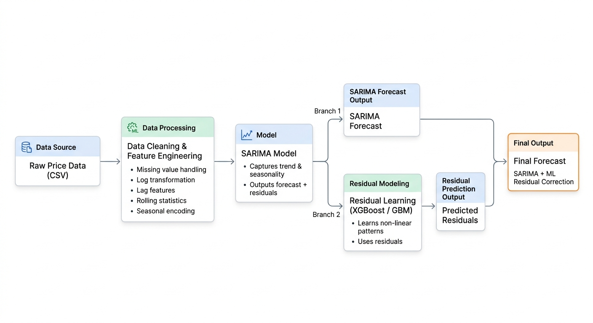
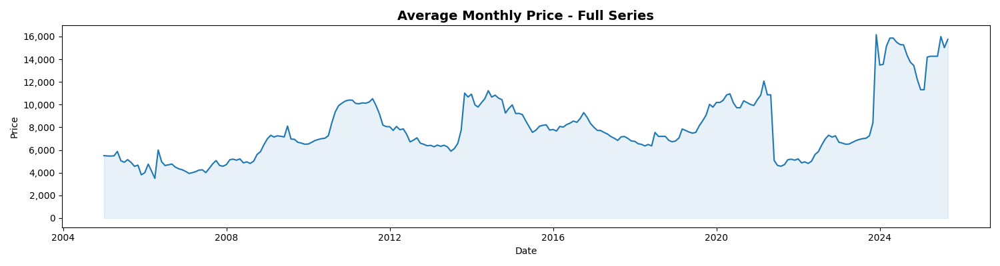
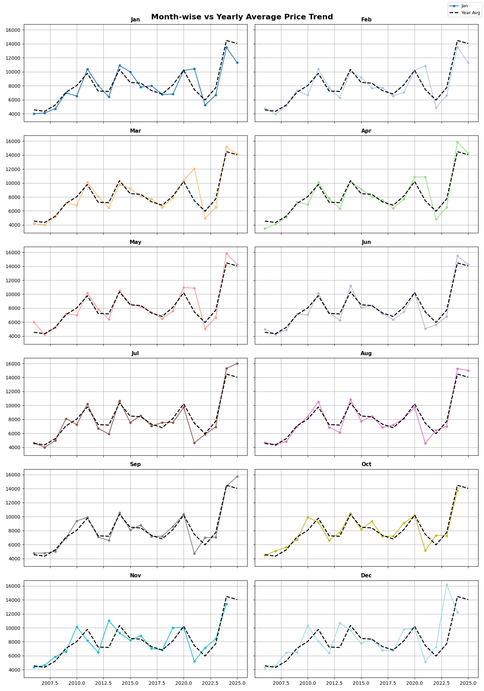
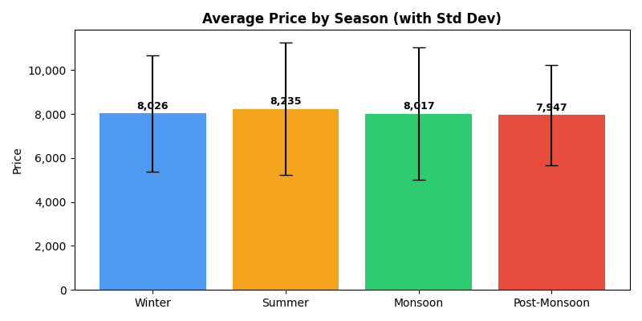
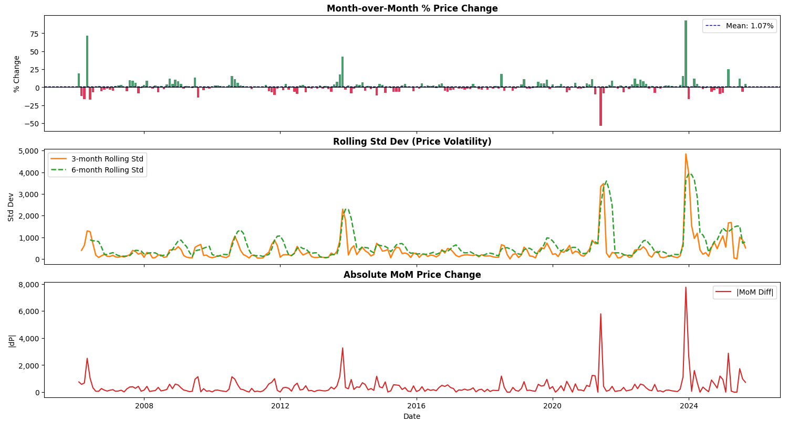
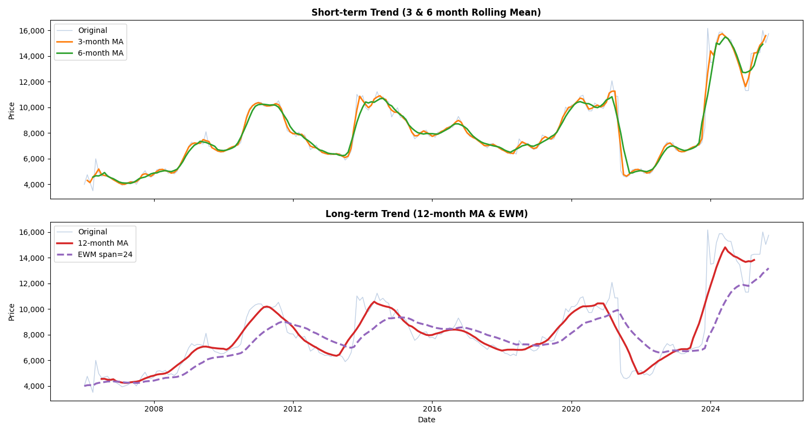
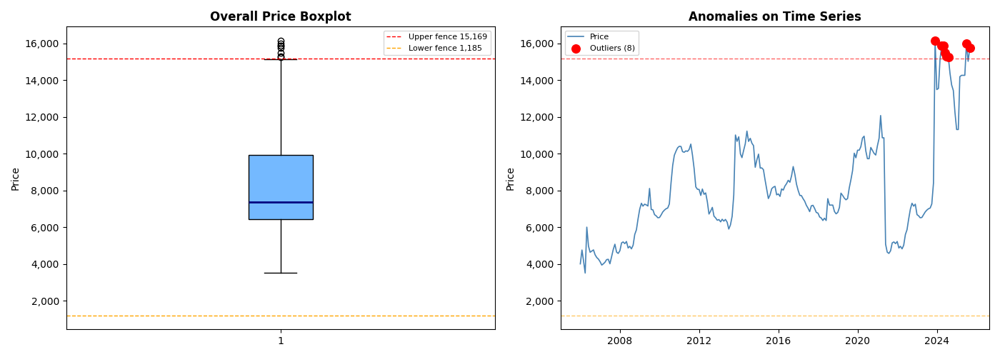
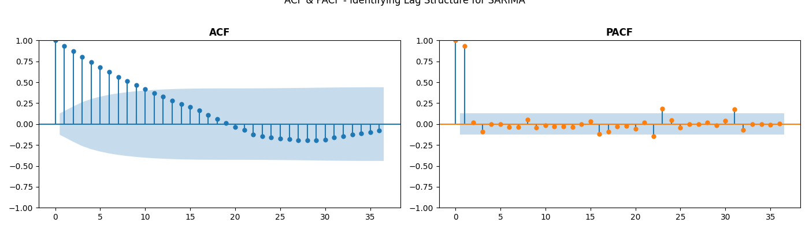
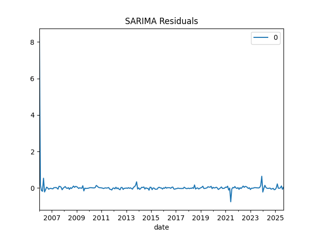
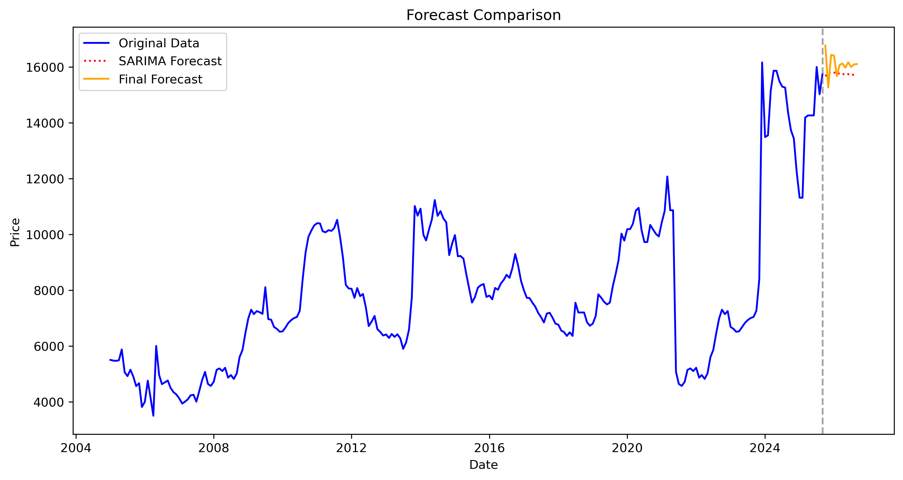

# 📈 Price Forecasting using SARIMA + Machine Learning (XGBoost / GBM)

A complete **end-to-end time series forecasting pipeline** that combines classical statistical modeling (**SARIMA**) with modern machine learning (**XGBoost / Gradient Boosting**) to produce accurate and robust price forecasts.

---

## 🔥 Key Highlights

* 📊 Comprehensive Exploratory Data Analysis (EDA)
* 🔍 Trend, Seasonality & Volatility decomposition
* ⚙️ SARIMA hyperparameter optimization (grid search)
* 🤖 Residual learning using XGBoost & Gradient Boosting
* ⚖️ Weighted training (recency + error-based weighting)
* 🔗 Hybrid modeling: **SARIMA + ML ensemble**
* 📅 12-month future forecasting
* 💾 Modular pipeline with saved models, plots & reports

---

## 🧠 Model Architecture



### 🔹 Methodology

1. SARIMA models **trend + seasonality**
2. Residuals are extracted from SARIMA predictions
3. ML models learn **non-linear residual patterns**
4. Final prediction:

```
Final Forecast = SARIMA Forecast + Residual Prediction
```

---

## 📂 Project Structure

```bash
price-forecasting-project/
│
├── config/              # YAML configs (paths, model settings)
├── data/                # Raw → processed datasets
├── models/              # Trained models (SARIMA, ML)
├── outputs/             # Plots, reports, predictions
├── pipeline/            # Pipeline scripts
├── src/                 # Core modules (EDA, models, utils)
├── notebooks/           # Experiments & exploration
├── requirements.txt
├── README.md
```

---

## 📊 Exploratory Data Analysis

### 🔹 Time Series Overview



* Long-term trend visualization
* Detects structural shifts and patterns

---

### 🔹 Monthly Seasonality



* Captures repeating **12-month seasonal cycles**

---

### 🔹 Season-wise Analysis



* Compares price behavior across:

  * Winter
  * Summer
  * Monsoon
  * Post-Monsoon

---

### 🔹 Volatility Analysis



* Month-over-month % change
* Rolling standard deviation

---

### 🔹 Time Series Trend



Breaks the series into:

* Short-term Trend
* Long-term Trend

---

## 📉 Outlier Detection



* IQR-based detection
* Z-score validation

📌 Outliers are retained as they may represent real market shocks.

---

## ⚙️ Feature Engineering

* Lag features: `lag_1, lag_2, lag_3, lag_12`
* Rolling statistics (mean, std)
* Log transformation
* Cyclical encoding (sin/cos for months)
* Trend features (differencing)
* Recency-based weighting

---

## 📌 SARIMA Modeling



* ACF / PACF analysis for lag selection
* Grid search over `(p, d, q)` and `(P, D, Q, s)`
* Best model selected using **AIC**

---

## 🤖 Residual Learning (XGBoost / GBM)



* Residuals from SARIMA used as target
* Models trained:

  * XGBoost
  * Gradient Boosting

📌 Captures non-linear patterns missed by SARIMA

---

## 📊 Model Performance

| Model   | RMSE |
| ------- | ---- |
| XGBoost | 0.067|

📌 Best model selected based on **RMSE**.

---

## 🔮 Final Forecast



* 12-month future prediction
* Hybrid SARIMA + ML model

📌 Produces smoother and more accurate forecasts than standalone SARIMA.

---

## 💾 Outputs

### 📁 Predictions

* `final_forecast.csv`

### 📁 Reports

* `reports.json`
* `reports.txt`
* `train reports.json`

### 📁 Models

* SARIMA model (`.pkl`)
* Residual ML model (`.pkl`)

---

## ⚙️ How to Run

```bash
# Install dependencies
pip install -r requirements.txt

# Run full pipeline
python -m pipeline.run_pipeline
```

---

## 🧪 Tech Stack

* Python
* Pandas, NumPy
* Matplotlib, Seaborn
* Statsmodels (SARIMA)
* XGBoost
* Scikit-learn

---

## 🚀 Key Insights

* Strong **annual seasonality (12-month cycle)**
* Clear **long-term upward trend**
* SARIMA captures structure but misses nonlinearities
* Residual ML significantly improves forecast accuracy

---

## 🔮 Future Improvements

* Hyperparameter tuning with Optuna
* Walk-forward (backtesting) validation
* Confidence intervals (probabilistic forecasting)
* Deployment via FastAPI / Streamlit
* Integration of external features (exogenous variables)

---

## 👨‍💻 Author

**Gopal Gupta**

---

## ⭐ If you found this useful, consider giving it a star!
---
